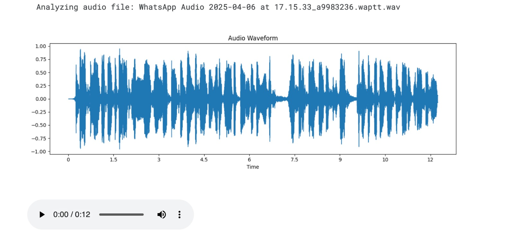
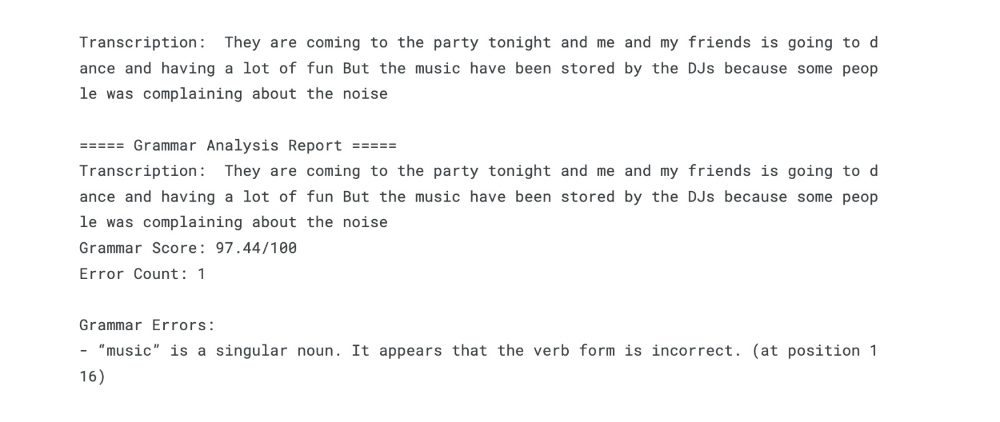

# Grammar Scoring Engine

A Python package for automated grammar assessment of audio recordings.

## 🚀 Installation

1. Clone the repository:
   ```bash
   git clone https://github.com/yourusername/grammar-scoring-engine.git
   cd grammar-scoring-engine
   ```

2. Install dependencies:
   ```bash
   pip install -r requirements.txt
   ```

3. Run the installation script:
   ```bash
   python install.py
   ```

## 📦 Usage

### Basic Usage

```python
from grammar_scoring.main import complete_grammar_scoring_workflow

# Example 1: Process a single audio file
result = complete_grammar_scoring_workflow(
    audio_file="path/to/your/audio.wav",
    use_whisper=True  # Set to True for better transcription quality
)

# Example 2: Process a directory of audio files
results_df = complete_grammar_scoring_workflow(
    dataset_name="path/to/your/audio/directory",
    use_whisper=False  # Set to True for better but slower transcription
)

# Print some results
if results_df is not None:
    print(f"Average Grammar Score: {results_df['grammar_score'].mean():.2f}/100")
```

## 📊 Results

The Grammar Scoring Engine provides detailed analysis including:

1. **Audio Waveform Visualization**
   
   

2. **Grammar Analysis Report**
   
   

The system provides:
- Accurate audio transcription
- Grammar score (0-100)
- Error detection and counting
- Detailed grammar error explanations
- Position-specific error highlighting

In the example above, the system:
- Achieved a 97.44/100 grammar score
- Detected 1 grammar error
- Provided specific feedback about singular/plural agreement
- Generated a clear waveform visualization of the audio input

## 🔧 Features

- **Audio Processing**
  - Support for multiple audio formats (.wav, .mp3, etc.)
  - Real-time audio recording c apability
  - Waveform visualization
  - Batch processing of audio files

- **Transcription Options**
  - OpenAI Whisper integration for high-accuracy transcription
  - Fallback to default transcription engine
  - Multi-language support

- **Grammar Analysis**
  - Detailed error detection and classification
  - Context-aware grammar checking
  - Position-specific error highlighting
  - Comprehensive scoring system (0-100)

- **Reporting**
  - Visual analytics and graphs
  - Detailed error explanations
  - Progress tracking for batch processing
  - Export capabilities for analysis results

## 📋 Requirements

- Python 3.7+
- FFmpeg (for audio processing)
- Required Python packages:
  - whisper
  - pandas
  - numpy
  - matplotlib
  - sounddevice
  - soundfile
  - tqdm

## 🤝 Contributing

1. Fork the repository
2. Create your feature branch (`git checkout -b feature/amazing-feature`)
3. Commit your changes (`git commit -m 'Add some amazing feature'`)
4. Push to the branch (`git push origin feature/amazing-feature`)
5. Open a Pull Request

## 📝 License

This project is licensed under the MIT License - see the [LICENSE](LICENSE) file for details.

## 📬 Contact

For questions and support, please open an issue in the GitHub repository.

